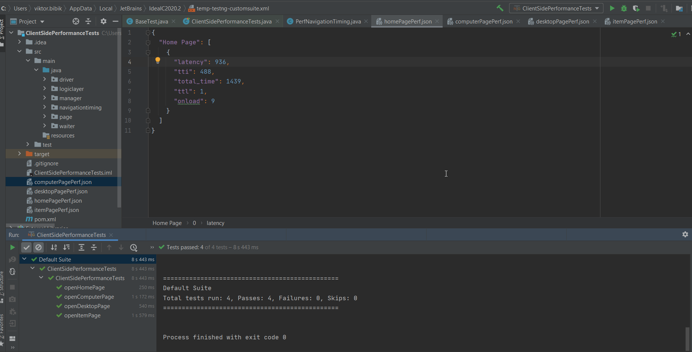
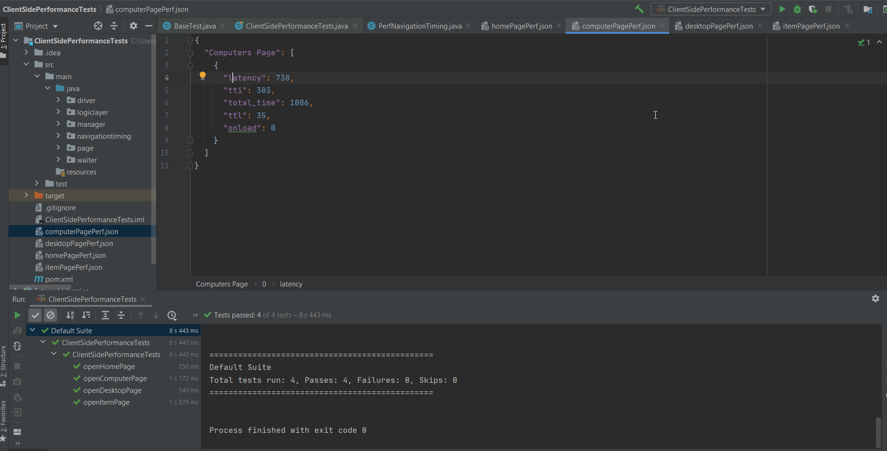
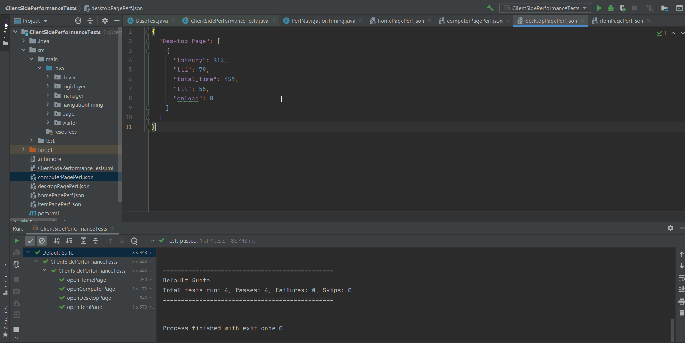
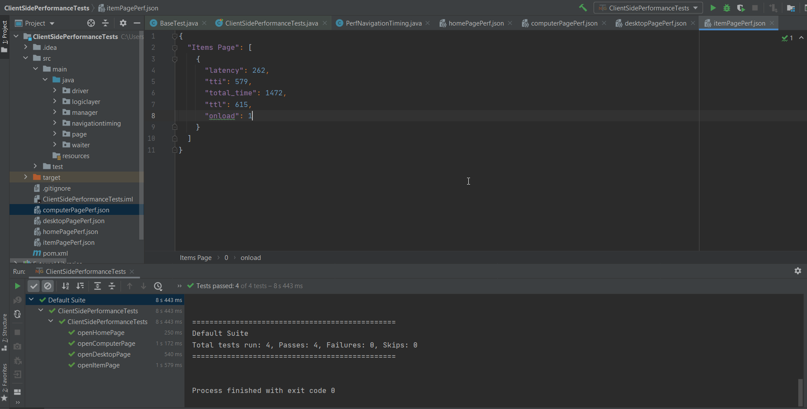

1. [homePagePerf.json](src/main/resources/performancedata/homePagePerf.json) - Link to "Home page" client side performance testing results.
2. [computerPagePerf.json](src/main/resources/performancedata/computerPagePerf.json) - Link to "Computer page" client side performance testing results.
3. [desktopPagePerf.json](src/main/resources/performancedata/desktopPagePerf.json) - Link to "Desktop page" client side performance testing results.
4. [itemPagePerf.json](src/main/resources/performancedata/itemPagePerf.json) - Link to "Item page" client side performance testing results.

